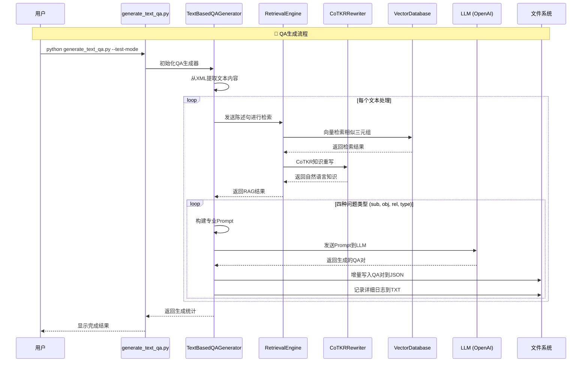
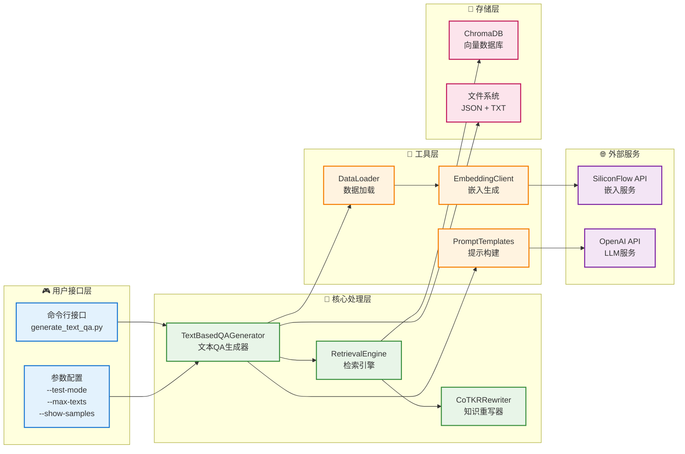
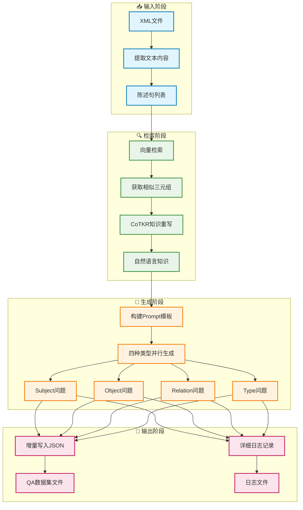

# 完整系统流程图

## 🎯 系统概览

这是一个基于知识图谱的RAG系统，支持增量写入的QA数据集生成。

## 📊 完整系统架构流程图

```mermaid
graph TB
    %% 数据源
    subgraph "📁 数据源"
        DS[Train数据集<br/>XML文件]
        DS --> |包含| T[三元组<br/>(Subject, Relation, Object)]
        DS --> |包含| S[Schema<br/>(SubType, RelType, ObjType)]
        DS --> |包含| TXT[文本内容<br/>&lt;text&gt;标签]
    end

    %% 数据库初始化阶段
    subgraph "🔧 数据库初始化阶段"
        DL[DataLoader<br/>数据加载器]
        EC[EmbeddingClient<br/>嵌入客户端]
        VDB[VectorDatabase<br/>ChromaDB]
        
        DS --> DL
        DL --> |提取三元组+Schema| EC
        EC --> |SiliconFlow API<br/>生成向量| VDB
    end

    %% QA生成阶段
    subgraph "🚀 QA生成阶段"
        TQG[TextBasedQAGenerator<br/>文本QA生成器]
        RE[RetrievalEngine<br/>检索引擎]
        CR[CoTKRRewriter<br/>知识重写器]
        PT[PromptTemplates<br/>提示模板]
        LLM[OpenAI GPT-3.5<br/>大语言模型LLM]
        
        TXT --> TQG
        TQG --> |陈述句| RE
        VDB --> |向量检索| RE
        RE --> |检索结果| CR
        CR --> |自然语言重写| PT
        PT --> |构建Prompt| LLM
        LLM --> |生成QA对| QA[QA对结果]
    end

    %% 增量写入系统
    subgraph "💾 增量写入系统"
        IW[增量写入器]
        LOG[日志记录器]
        QF[QA数据集文件<br/>JSON格式]
        LF[详细日志文件<br/>TXT格式]
        
        QA --> IW
        QA --> LOG
        IW --> |实时保存| QF
        LOG --> |详细记录| LF
    end

    %% 四种问题类型生成
    subgraph "🎯 四种问题类型"
        SUB[Subject问题<br/>询问主语]
        OBJ[Object问题<br/>询问宾语]
        REL[Relation问题<br/>询问关系]
        TYPE[Type问题<br/>询问类型]
        
        TQG --> SUB
        TQG --> OBJ
        TQG --> REL
        TQG --> TYPE
    end

    %% 样式定义
    classDef dataSource fill:#e1f5fe,stroke:#01579b,stroke-width:2px
    classDef processing fill:#e8f5e8,stroke:#2e7d32,stroke-width:2px
    classDef storage fill:#fff3e0,stroke:#e65100,stroke-width:2px
    classDef output fill:#f3e5f5,stroke:#7b1fa2,stroke-width:2px
    classDef llm fill:#ffebee,stroke:#c62828,stroke-width:2px

    class DS,T,S,TXT dataSource
    class DL,EC,TQG,RE,CR,PT processing
    class VDB,IW,LOG storage
    class QF,LF,QA output
    class LLM llm
```

## 🔄 详细数据流程图



## 🏗 系统组件架构图



## 📋 数据处理流水线



## 🔄 CoTKR重写流程详图

```mermaid
graph TB
    subgraph "🔍 CoTKR知识重写流程"
        A[输入陈述句<br/>"The runway length of Airport is 1533"]
        A --> B[向量检索相似三元组]
        B --> C[检索结果<br/>(Airport, runwayLength, 1533)]
        
        C --> D[三元组转自然语言]
        D --> E["Airport has a runway length of 1533 meters."]
        
        E --> F[构建推理链]
        F --> G[Reason 1: 问题类型分析<br/>Knowledge 1: 自然语言知识<br/>Reason 2: 实体类型识别]
        
        G --> H[提取答案]
        H --> I[根据问题类型返回对应答案<br/>Subject: Airport<br/>Object: 1533<br/>Relation: runwayLength<br/>Type: Airport]
    end

    classDef process fill:#e8f5e8,stroke:#388e3c,stroke-width:2px
    classDef data fill:#e1f5fe,stroke:#0277bd,stroke-width:2px
    classDef result fill:#fff3e0,stroke:#f57c00,stroke-width:2px

    class B,D,F,H process
    class A,C,E,G data
    class I result
```

## 📊 增量写入机制图

```mermaid
graph LR
    subgraph "💾 增量写入机制"
        A[生成QA对] --> B{文件是否存在?}
        B -->|否| C[创建新文件<br/>写入 '[' + QA对]
        B -->|是| D[读取现有内容]
        D --> E[移除末尾 ']']
        E --> F[添加 ',' + 新QA对]
        F --> G[添加末尾 ']']
        C --> H[QA数据集文件]
        G --> H
        
        A --> I[记录详细日志]
        I --> J[追加到日志文件]
        J --> K[日志文件]
    end

    classDef process fill:#e8f5e8,stroke:#388e3c,stroke-width:2px
    classDef decision fill:#fff3e0,stroke:#f57c00,stroke-width:2px
    classDef output fill:#fce4ec,stroke:#c2185b,stroke-width:2px

    class A,C,D,E,F,G,I,J process
    class B decision
    class H,K output
```

## 🎯 系统特点总结

### ✅ 核心优势
1. **统一数据源**: 全部基于train数据集
2. **增量写入**: 实时保存，防止数据丢失
3. **详细日志**: 完整记录生成过程
4. **四种类型**: 支持多样化问题生成
5. **CoTKR增强**: 自然语言知识重写
6. **容错机制**: 程序中断不影响已生成数据

### 🔧 技术栈
- **向量数据库**: ChromaDB
- **嵌入模型**: BAAI/bge-m3 (via SiliconFlow)
- **语言模型**: OpenAI GPT-3.5-turbo
- **知识重写**: CoTKR (Chain-of-Thought Knowledge Rewriting)
- **数据格式**: JSON (QA数据集) + TXT (详细日志)

### 📈 处理能力
- **数据规模**: 支持处理数千个文本
- **生成效率**: 每个文本生成4种类型QA对
- **质量保证**: 自动质量检查和统计分析
- **可扩展性**: 模块化设计，易于扩展

这个系统实现了从原始XML数据到高质量QA数据集的完整转换流程！