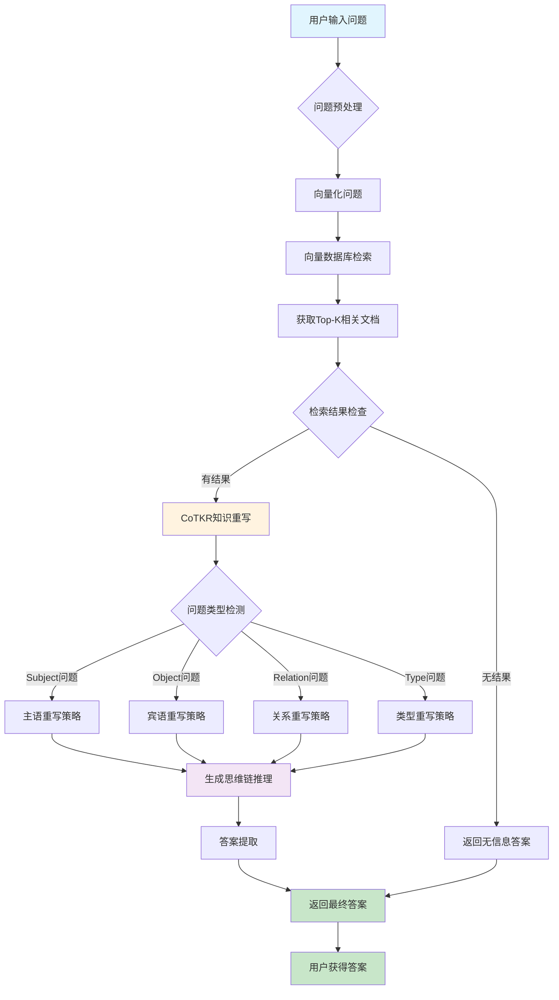
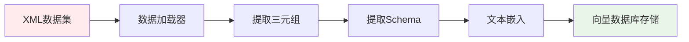
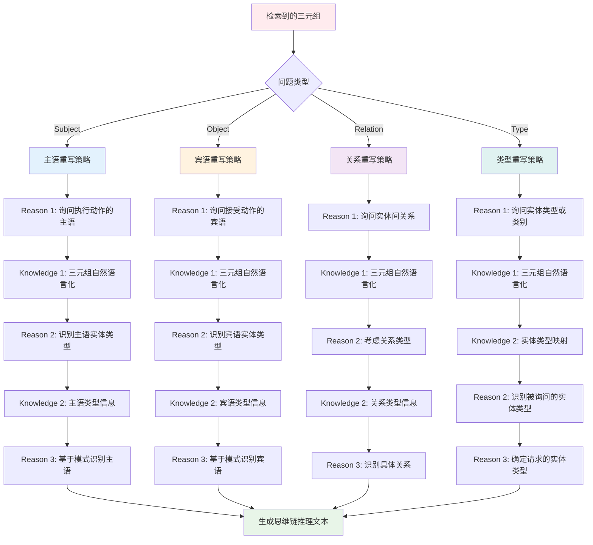
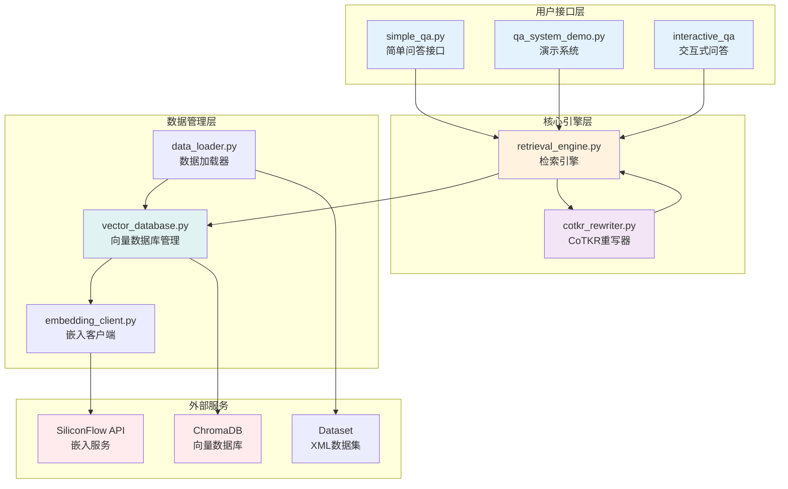
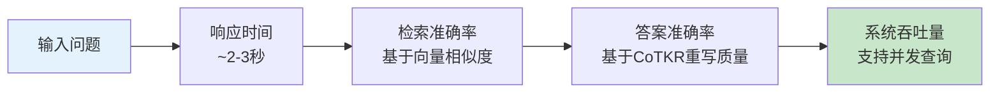

# KG-RAG 问答系统流程图

## 完整问答系统架构流程



## 详细组件流程

### 1. 数据准备阶段



### 2. 问答核心流程

```mermaid
flowchart TD
    Start([用户问题输入]) --> Input[问题: "Who is the leader of Belgium?"]
    
    Input --> Embed[SiliconFlow嵌入模型<br/>BAAI/bge-m3]
    Embed --> Vector[问题向量化]
    
    Vector --> Search[ChromaDB向量检索<br/>Top-5相似文档]
    Search --> Retrieved[检索结果:<br/>1. (Belgium, capital, Brussels)<br/>2. (Iraq, leader, Haider_al-Abadi)<br/>3. (Pakistan, leader, Anwar_Zaheer_Jamali)]
    
    Retrieved --> Detect[问题类型检测<br/>结果: Subject类型]
    
    Detect --> CoTKR[CoTKR知识重写]
    CoTKR --> Reasoning[思维链推理:<br/>Reason 1: 询问主语实体<br/>Knowledge 1: 检索到的知识<br/>Reason 2: 识别实体类型<br/>Knowledge 2: 实体类型信息<br/>Reason 3: 基于模式识别主语]
    
    Reasoning --> Extract[答案提取<br/>基于Subject类型返回主语]
    Extract --> Answer[最终答案: "Belgium"]
    
    Answer --> End([返回给用户])
    
    style Start fill:#e3f2fd
    style End fill:#e8f5e8
    style CoTKR fill:#fff3e0
    style Reasoning fill:#f3e5f5
    style Answer fill:#c8e6c9
```

### 3. CoTKR重写策略详解



### 4. 答案提取流程

```mermaid
graph TD
    A[CoTKR重写知识] --> B[检索结果三元组]
    B --> C{问题类型}
    
    C -->|Subject| D[返回三元组主语<br/>sub.replace('_', ' ')]
    C -->|Object| E[返回三元组宾语<br/>obj.replace('_', ' ')]
    C -->|Relation| F[返回三元组关系<br/>rel.replace('_', ' ')]
    C -->|Type| G{实体匹配}
    
    G -->|匹配主语| H[返回主语类型<br/>sub_type]
    G -->|匹配宾语| I[返回宾语类型<br/>obj_type]
    G -->|默认| J[返回主语类型<br/>sub_type]
    
    D --> K[最终答案]
    E --> K
    F --> K
    H --> K
    I --> K
    J --> K
    
    style A fill:#ffebee
    style K fill:#c8e6c9
```

## 系统组件架构



## 问题类型处理示例

### Subject类型问题
```
问题: "Who is the leader of Belgium?"
检索: (Belgium, capital, Brussels), (Iraq, leader, Haider_al-Abadi)
重写: 识别询问主语实体，基于关系模式确定主语
答案: "Belgium" (返回主语)
```

### Object类型问题
```
问题: "Where is Amsterdam Airport located?"
检索: (Amsterdam_Airport_Schiphol, location, Netherlands)
重写: 识别询问宾语实体，基于关系确定位置
答案: "Netherlands" (返回宾语)
```

### Relation类型问题
```
问题: "What is the relationship between Amsterdam Airport and Netherlands?"
检索: (Amsterdam_Airport_Schiphol, location, Netherlands)
重写: 识别询问实体间关系
答案: "location" (返回关系)
```

### Type类型问题
```
问题: "What type of entity is Belgium?"
检索: (Belgium, capital, Brussels)
重写: 识别询问实体类型，匹配实体确定类型
答案: "Country" (返回实体类型)
```

## 性能指标



## 配置参数

| 参数 | 值 | 说明 |
|------|----|----|
| 嵌入模型 | BAAI/bge-m3 | SiliconFlow提供 |
| 检索数量 | Top-5 | 默认检索5个相关文档 |
| 向量数据库 | ChromaDB | 本地向量存储 |
| 问题类型 | 4种 | sub, obj, rel, type |
| 重写策略 | CoTKR | 思维链知识重写 |

这个问答系统通过完整的RAG流程，能够准确理解用户问题，检索相关知识，并通过CoTKR方法生成高质量的答案。