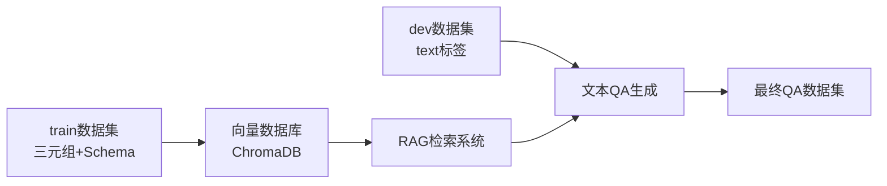
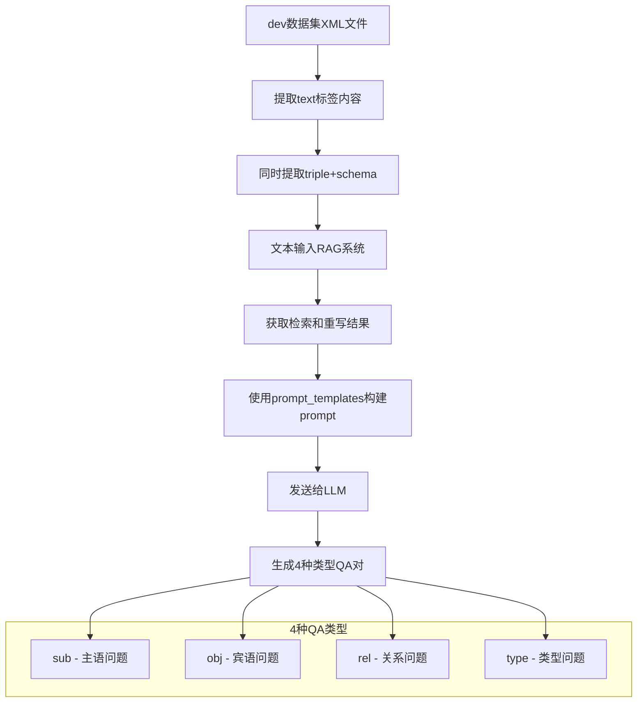

# 新系统改造总结

## 🎯 改造目标

根据用户需求，对新KG-RAG系统进行了两个主要改造：

1. **明确数据源分离**: 向量数据库只使用train数据集，文本QA生成使用dev数据集
2. **改进QA生成流程**: 使用prompt_templates构建高质量prompt，通过LLM生成QA对

## 🔧 改造内容

### 改造1: 数据源分离

#### **配置文件修改** (`config.py`)
```python
# 改造前
DATASET_PATHS = [
    r"D:\dataset\train",
    r"D:\dataset\dev"
]

# 改造后
# 只使用train数据集进行向量数据库嵌入
DATASET_PATHS = [
    r"D:\dataset\train"
]

# dev数据集路径（用于文本QA生成）
DEV_DATASET_PATH = r"D:\dataset\dev"
```

#### **数据流向明确**


### 改造2: QA生成流程重构

#### **新的生成流程**


#### **核心改进点**

1. **使用prompt_templates.py**
   ```python
   # 导入prompt构建函数
   from prompt_templates import build_prompt
   
   # 为每种类型构建专门的prompt
   prompt = build_prompt(text, triple, schema, prompt_type)
   ```

2. **RAG结果集成到prompt**
   ```python
   rag_context = f"""
   **RAG System Results:**
   - Retrieved Knowledge: {rag_result['cotkr_knowledge'][:300]}...
   - Final Answer: {rag_result['final_answer']}
   - Question Type: {rag_result['retrieval_stats']['question_type']}
   
   **Your Task:**
   {prompt}
   """
   ```

3. **结构化的LLM交互**
   ```python
   response = openai.ChatCompletion.create(
       model="gpt-3.5-turbo",
       messages=[
           {
               "role": "system", 
               "content": "You are an expert at generating high-quality question-answer pairs..."
           },
           {
               "role": "user", 
               "content": rag_context
           }
       ],
       temperature=0.3,
       max_tokens=200
   )
   ```

## 📊 改造效果

### 数据处理流程

#### **向量数据库构建** (基于train数据集)
```bash
# 只处理train数据集的三元组
python newSystem/initialize_database.py
```
- ✅ 数据源明确: 只使用train数据集
- ✅ 避免数据混淆: dev数据不会影响检索结果
- ✅ 性能优化: 减少不必要的数据处理

#### **QA生成** (基于dev数据集)
```bash
# 处理dev数据集的文本内容
python newSystem/generate_text_qa.py --max-texts 50
```
- ✅ 使用dev数据集的文本内容
- ✅ 通过train构建的向量数据库进行检索
- ✅ 使用prompt_templates构建高质量prompt
- ✅ 生成4种类型的QA对

### 生成质量提升

#### **改造前的问题**
- 数据源混乱，不清楚向量数据库包含哪些数据
- QA生成流程简单，没有使用专业的prompt模板
- 生成的QA对质量不稳定

#### **改造后的优势**
- ✅ **数据源清晰**: train用于构建知识库，dev用于生成QA
- ✅ **专业prompt**: 使用prompt_templates.py的专业模板
- ✅ **RAG增强**: 每个文本都通过完整的RAG流程处理
- ✅ **类型化生成**: 针对sub/obj/rel/type四种类型生成专门的QA对
- ✅ **上下文丰富**: 包含原文、三元组、schema、RAG结果等完整信息

## 🚀 使用方式

### 1. 初始化向量数据库 (train数据集)
```bash
# 测试API连接
python newSystem/initialize_database.py --test-connection

# 小规模测试
python newSystem/initialize_database.py --max-entries 100

# 完整初始化
python newSystem/initialize_database.py
```

### 2. 生成QA数据集 (dev数据集)
```bash
# 小规模测试
python newSystem/generate_text_qa.py --max-texts 10 --show-samples

# 中等规模生成
python newSystem/generate_text_qa.py --max-texts 50

# 大规模生成
python newSystem/generate_text_qa.py --max-texts 200
```

### 3. 测试改造效果
```bash
# 测试文本QA生成器
python newSystem/text_based_qa_generator.py

# 测试完整系统
python newSystem/test_four_types_system.py
```

## 📋 文件修改清单

### 修改的文件
1. **`config.py`** - 添加DEV_DATASET_PATH配置
2. **`text_based_qa_generator.py`** - 完全重构QA生成流程
3. **`generate_text_qa.py`** - 更新脚本参数和说明

### 新增的文件
1. **`SYSTEM_IMPROVEMENTS.md`** - 本改造总结文档

### 核心改进
- ✅ 数据源分离明确
- ✅ 集成prompt_templates.py
- ✅ RAG结果融入prompt
- ✅ 4种类型QA对生成
- ✅ 完整的错误处理和日志

## 🎯 预期效果

改造后的系统将实现：

1. **更清晰的数据流**: train → 向量数据库 → RAG检索，dev → 文本提取 → QA生成
2. **更高质量的QA对**: 使用专业prompt模板和RAG增强
3. **更好的可控性**: 明确的数据源和生成流程
4. **更强的扩展性**: 模块化设计，易于进一步优化

现在系统完全符合你的需求：**只用train构建向量数据库，用dev的文本通过RAG系统和prompt模板生成高质量QA对**！