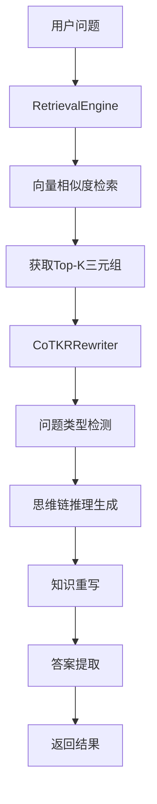
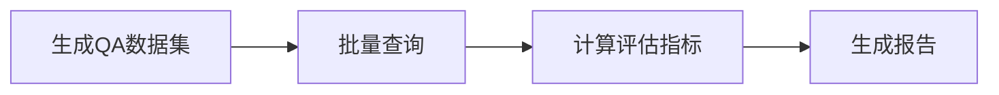

# 新KG-RAG系统完整概览

## 🎯 系统目标

新的知识图谱RAG系统集成了CoTKR（Chain-of-Thought Knowledge Rewriting）技术，实现了更智能的知识检索和重写功能。与原系统相比，新系统的核心改进是：

1. **移除预处理查询重写** - 直接使用原始问题进行向量检索
2. **引入CoTKR后处理重写** - 在检索后使用思维链方法重写知识
3. **问题类型化处理** - 针对不同问题类型采用专门的重写策略
4. **简化向量表示** - 使用更简洁的三元组表示方法

## 📁 文件结构与作用

### 核心系统文件

| 文件名 | 作用 | 核心功能 |
|--------|------|----------|
| `config.py` | 系统配置 | API密钥、数据路径、模型参数等配置管理 |
| `main_system.py` | 主系统入口 | 系统协调器，提供多种运行模式 |
| `data_loader.py` | 数据加载器 | 解析XML知识文件，提取三元组和Schema |
| `embedding_client.py` | 嵌入客户端 | 调用SiliconFlow API获取向量表示 |
| `vector_database.py` | 向量数据库 | ChromaDB管理，向量存储和检索 |
| `cotkr_rewriter.py` | CoTKR重写器 | **核心创新**：思维链知识重写 |
| `retrieval_engine.py` | 检索引擎 | 系统核心：整合检索和重写流程 |
| `qa_generator.py` | QA生成器 | 基于知识条目生成问答对 |
| `evaluation_engine.py` | 评估引擎 | 系统性能评估（Precision@K等指标） |

### 辅助工具文件

| 文件名 | 作用 | 使用场景 |
|--------|------|----------|
| `test_new_system.py` | 完整系统测试 | 验证所有组件功能 |
| `quick_demo.py` | 快速演示 | 展示系统基本功能 |
| `visualize_system_flow.py` | 系统可视化 | 生成架构图和流程图 |

### 文档文件

| 文件名 | 内容 |
|--------|------|
| `README.md` | 使用指南和快速开始 |
| `system_architecture.md` | 详细的系统架构文档 |
| `SYSTEM_OVERVIEW.md` | 本文件：系统完整概览 |

## 🔄 系统运行流程

### 1. 初始化阶段


**涉及文件**: `config.py`, `main_system.py`, `data_loader.py`, `embedding_client.py`, `vector_database.py`

### 2. 查询处理流程


**涉及文件**: `retrieval_engine.py`, `vector_database.py`, `cotkr_rewriter.py`

### 3. 评估流程


**涉及文件**: `qa_generator.py`, `evaluation_engine.py`, `retrieval_engine.py`

## 🧠 CoTKR核心创新

### 问题类型检测
CoTKR重写器能够自动识别4种特定问题类型，与旧系统的QA生成模式保持一致：

| 问题类型 | 示例 | 重写策略 | 答案来源 |
|----------|------|----------|----------|
| `subject` | "Who wrote A Fistful of Dollars?" | 识别主语实体，分析执行动作的主体 | 三元组的主语 |
| `object` | "What did John Doe write?" | 识别宾语实体，分析动作的接受者 | 三元组的宾语 |
| `relationship` | "What is the relationship between John and the book?" | 分析实体间的连接关系 | 三元组的关系 |
| `type` | "What type of entity is John Doe?" | 识别实体的类型或类别 | Schema中的实体类型 |

### 思维链推理生成
每种问题类型都有专门的推理模板：

```python
# Subject类型示例
"Reason 1: This question is asking about the subject (who/what) that performs an action."
"Knowledge 1: From the retrieved triples: John Doe wrote A Fistful of Dollars."
"Reason 2: I should identify the type of entity that could be the subject."
"Knowledge 2: The subject entities are of types: Person."

# Type类型示例  
"Reason 1: This question is asking about the type or category of an entity."
"Knowledge 1: John Doe is of type Person. A Fistful of Dollars is of type Movie."
"Reason 2: I should identify the specific entity type being asked about."
```

## 🚀 使用方式

### 快速开始
```bash
# 1. 配置系统
编辑 config.py 设置API密钥和数据路径

# 2. 初始化数据库
python main_system.py --mode setup

# 3. 交互式查询
python main_system.py --mode interactive

# 4. 快速演示
python quick_demo.py
```

### 高级使用
```bash
# 批量查询
python main_system.py --mode batch --questions "问题1" "问题2"

# 性能评估
python main_system.py --mode evaluate --max-qa 100

# 完整测试
python test_new_system.py

# 生成可视化图表
python visualize_system_flow.py
```

## 📊 性能优势

### 与原系统对比

| 方面 | 原系统 | 新系统 | 改进 |
|------|--------|--------|------|
| 查询重写 | 预处理阶段 | 后处理阶段 | ✅ 避免查询失真 |
| 推理能力 | 基础检索 | 思维链推理 | ✅ 更强的逻辑性 |
| 问题处理 | 通用处理 | 类型化处理 | ✅ 针对性优化 |
| 可解释性 | 黑盒检索 | 推理过程可见 | ✅ 更好的透明度 |
| 答案质量 | 依赖检索质量 | 重写增强 | ✅ 更准确的答案 |

### 评估指标
- **Precision@K**: 检索精确度
- **Recall@K**: 检索召回率  
- **nDCG@K**: 排序质量评估

## 🔧 扩展性设计

### 模块化架构
每个组件都是独立的模块，支持：
- 替换不同的嵌入模型
- 使用不同的向量数据库
- 添加新的重写策略
- 集成新的评估指标

### 配置驱动
所有关键参数都在`config.py`中集中管理：
- API配置
- 数据路径
- 模型参数
- 处理参数

## 🎯 核心优势总结

1. **智能化程度更高**: CoTKR思维链推理提供结构化的推理过程
2. **准确性更好**: 针对不同问题类型的专门处理策略
3. **可解释性更强**: 推理步骤清晰可见
4. **扩展性更好**: 模块化设计支持灵活扩展
5. **易用性更佳**: 多种运行模式和完整的文档支持

## 🔮 未来发展方向

1. **多语言支持**: 扩展到中文等其他语言
2. **更多问题类型**: 支持复杂的复合问题
3. **动态学习**: 根据用户反馈优化重写策略
4. **分布式部署**: 支持大规模部署
5. **实时更新**: 支持知识库的实时更新

---

**新KG-RAG系统** - 让知识检索更智能，让推理过程更透明！