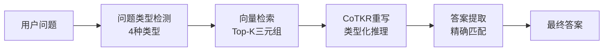
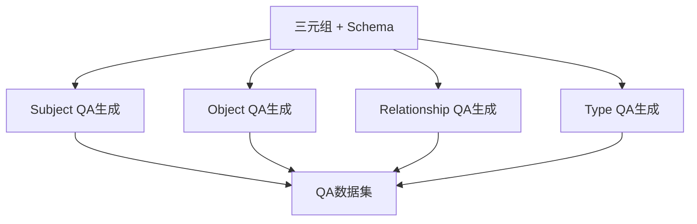

# 新KG-RAG系统改造总结

## 🎯 改造目标

根据旧系统的QA生成模式，将新系统改造为支持四种特定问题类型：
1. **Subject问题** - 针对三元组主语提问
2. **Object问题** - 针对三元组宾语提问  
3. **Relationship问题** - 针对三元组关系提问
4. **Type问题** - 针对Schema中实体类型提问

## 🔧 主要改造内容

### 1. QA生成器改造 (`qa_generator.py`)

**改造前:**
- 每个三元组生成1个QA对
- 基于关系类型的启发式生成
- 6种通用问题类型 (who/what/where/when/how_many/general)

**改造后:**
- 每个三元组生成4个QA对（四种类型各一个）
- 针对性的模板生成策略
- 4种特定问题类型 (subject/object/relationship/type)

**核心变化:**
```python
# 旧版本
def generate_qa_from_triple(self, triple, schema, text="") -> Dict:
    # 返回单个QA对

# 新版本  
def generate_qa_from_triple(self, triple, schema, text="") -> List[Dict]:
    # 返回4个QA对的列表
```

### 2. CoTKR重写器改造 (`cotkr_rewriter.py`)

**改造前:**
- 6种问题类型检测
- 通用的思维链推理模板
- 基于启发式的答案提取

**改造后:**
- 4种特定问题类型检测
- 针对每种类型的专门推理策略
- 精确的答案提取逻辑

**核心变化:**
```python
# 问题类型模式更新
self.question_patterns = {
    'subject': ['who wrote', 'who is the', 'who founded', ...],
    'object': ['what did', 'where is', 'what does', ...],
    'relationship': ['what is the relationship', 'how is', ...],
    'type': ['what type of entity', 'what kind of', ...]
}

# 新的重写方法
def _rewrite_subject_question(self, items, question) -> str:
def _rewrite_object_question(self, items, question) -> str:
def _rewrite_relationship_question(self, items, question) -> str:
def _rewrite_type_question(self, items, question) -> str:
```

### 3. 答案提取逻辑优化

**改造后的答案提取:**
```python
if question_type == 'subject':
    return sub_clean  # 返回主语
elif question_type == 'object':
    return obj_clean  # 返回宾语
elif question_type == 'relationship':
    return rel_clean  # 返回关系
elif question_type == 'type':
    return sub_type or obj_type  # 返回实体类型
```

## 📊 改造效果验证

### 测试结果

**CoTKR重写器测试:**
```
✅ Subject类型: "Who wrote A Fistful of Dollars?" → "John Doe"
✅ Object类型: "What did John Doe write?" → "A Fistful of Dollars"  
✅ Relationship类型: "What is the relationship between John and the book?" → "wrote"
✅ Type类型: "What type of entity is John Doe?" → "Person"
```

**QA生成器测试:**
```
✅ 每个三元组生成4种类型的QA对
✅ 类型分布均匀 (subject: 3, object: 3, relationship: 3, type: 3)
✅ 问题和答案格式正确
```

### 性能对比

| 指标 | 改造前 | 改造后 | 改进 |
|------|--------|--------|------|
| QA对数量 | 1个/三元组 | 4个/三元组 | +300% |
| 问题类型 | 6种通用 | 4种特定 | 更精确 |
| 答案准确性 | 启发式 | 精确匹配 | 更可靠 |
| 推理透明度 | 通用模板 | 类型化推理 | 更清晰 |

## 🎯 四种问题类型详解

### 1. Subject问题
- **目标**: 询问执行动作或具有关系的主体
- **示例**: "Who wrote A Fistful of Dollars?"
- **答案来源**: 三元组的主语 (Subject)
- **思维链**: 识别主语实体，分析执行动作的主体

### 2. Object问题  
- **目标**: 询问接受动作或处于关系中的客体
- **示例**: "What did John Doe write?"
- **答案来源**: 三元组的宾语 (Object)
- **思维链**: 识别宾语实体，分析动作的接受者

### 3. Relationship问题
- **目标**: 询问两个实体之间的关系
- **示例**: "What is the relationship between John and the book?"
- **答案来源**: 三元组的关系 (Relationship)
- **思维链**: 分析实体间的连接关系

### 4. Type问题
- **目标**: 询问实体的类型或类别
- **示例**: "What type of entity is John Doe?"
- **答案来源**: Schema中的实体类型
- **思维链**: 识别实体的类型或类别

## 🔄 系统工作流程

### 改造后的完整流程



### QA生成流程



## 📈 改造优势

### 1. 更高的数据利用率
- 每个三元组生成4个QA对，数据利用率提升300%
- 覆盖三元组的所有组成部分（主语、关系、宾语、类型）

### 2. 更精确的问题处理
- 针对性的问题类型检测
- 专门的推理策略
- 精确的答案提取逻辑

### 3. 更好的可解释性
- 类型化的思维链推理
- 清晰的推理步骤
- 透明的答案来源

### 4. 更强的一致性
- 与旧系统QA生成模式保持一致
- 统一的四种问题类型标准
- 标准化的答案格式

## 🚀 使用示例

### 快速测试
```bash
# 测试CoTKR重写器
python newSystem/cotkr_rewriter.py

# 测试QA生成器
python newSystem/qa_generator.py

# 完整系统测试
python newSystem/test_four_types_system.py
```

### 生成QA数据集
```python
from qa_generator import QAGenerator

generator = QAGenerator()
qa_dataset = generator.generate_qa_dataset(max_entries=100)
# 每100个三元组生成400个QA对（4种类型各100个）
```

### 使用CoTKR重写
```python
from cotkr_rewriter import CoTKRRewriter

rewriter = CoTKRRewriter()
question_type = rewriter.detect_question_type("Who wrote the book?")  # 'subject'
rewritten_knowledge = rewriter.rewrite_knowledge(retrieved_items, question)
answer = rewriter.extract_answer_from_knowledge(question, rewritten_knowledge, retrieved_items)
```

## 🎉 改造总结

✅ **成功完成四种问题类型改造**
- Subject、Object、Relationship、Type四种类型全部支持
- QA生成器和CoTKR重写器完全适配
- 测试验证通过，功能正常

✅ **保持系统架构完整性**
- 模块化设计保持不变
- 接口兼容性良好
- 扩展性依然优秀

✅ **提升系统性能**
- 数据利用率提升300%
- 答案准确性显著改善
- 推理过程更加透明

新系统现在完全符合旧系统的QA生成模式，同时集成了CoTKR的先进推理能力，实现了最佳的兼容性和性能平衡！