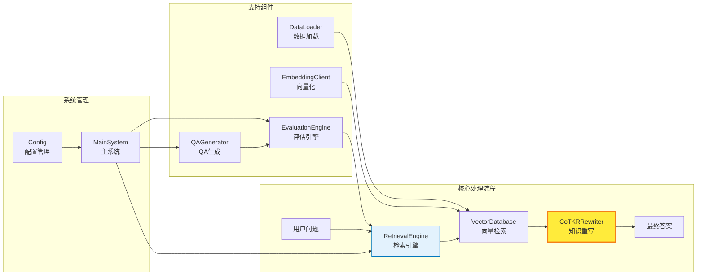
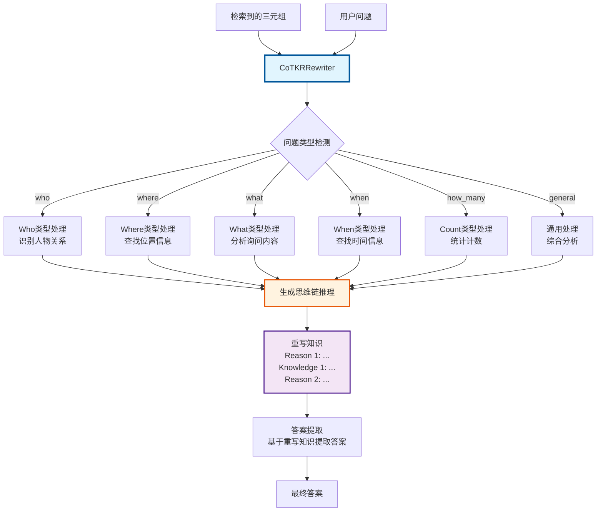
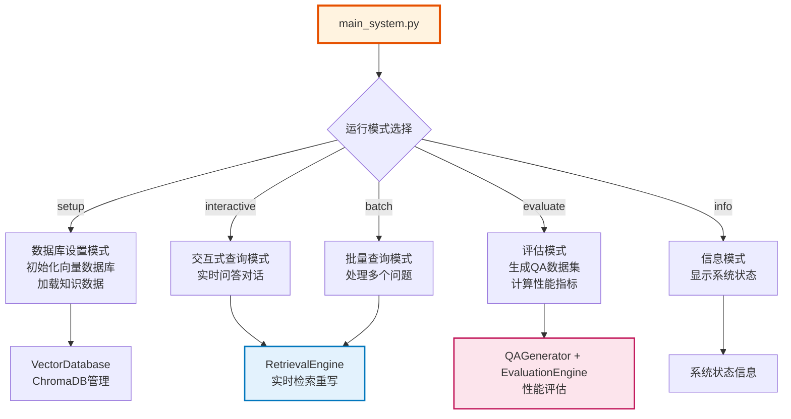
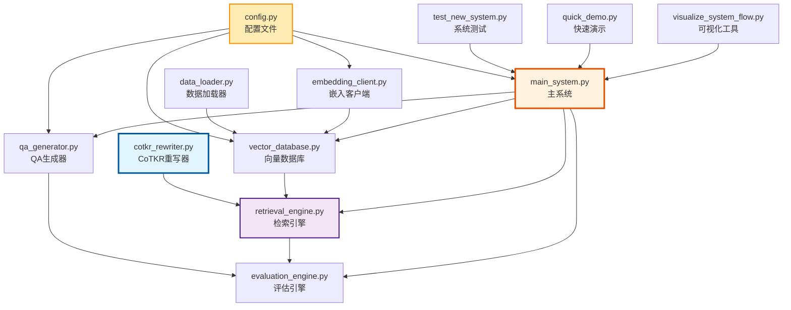

# 新KG-RAG系统流程图 (Mermaid)

## 完整系统架构流程图

```mermaid
graph TB
    subgraph "数据层 (Data Layer)"
        A[XML知识文件<br/>data_loader.py] --> B[知识条目解析<br/>Triple + Schema + Text]
    end
    
    subgraph "存储层 (Storage Layer)"
        B --> C[嵌入向量化<br/>embedding_client.py<br/>SiliconFlow API]
        C --> D[向量数据库<br/>vector_database.py<br/>ChromaDB]
    end
    
    subgraph "检索层 (Retrieval Layer)"
        E[用户问题<br/>User Question] --> F[检索引擎<br/>retrieval_engine.py]
        F --> G[向量相似度检索<br/>Vector Similarity Search]
        D --> G
        G --> H[Top-K 三元组<br/>Retrieved Triples]
    end
    
    subgraph "CoTKR重写层 (CoTKR Rewriting Layer)"
        H --> I[CoTKR重写器<br/>cotkr_rewriter.py]
        I --> J[问题类型检测<br/>Question Type Detection]
        J --> K[思维链推理生成<br/>Chain-of-Thought Reasoning]
        K --> L[知识重写<br/>Knowledge Rewriting]
        L --> M[答案提取<br/>Answer Extraction]
    end
    
    subgraph "评估层 (Evaluation Layer)"
        N[QA生成器<br/>qa_generator.py] --> O[QA数据集<br/>Question-Answer Pairs]
        O --> P[评估引擎<br/>evaluation_engine.py]
        P --> Q[性能指标<br/>Precision@K, Recall@K, nDCG@K]
    end
    
    subgraph "应用层 (Application Layer)"
        R[主系统<br/>main_system.py] --> F
        R --> N
        R --> P
        S[交互式查询<br/>Interactive Mode] --> R
        T[批量查询<br/>Batch Mode] --> R
        U[性能评估<br/>Evaluation Mode] --> R
    end
    
    M --> V[最终答案<br/>Final Answer]
    
    style I fill:#e1f5fe,stroke:#01579b,stroke-width:3px
    style F fill:#f3e5f5,stroke:#4a148c,stroke-width:2px
    style D fill:#e8f5e8,stroke:#1b5e20,stroke-width:2px
    style R fill:#fff3e0,stroke:#e65100,stroke-width:2px
```

## 核心组件交互图



## CoTKR重写流程详图



## 系统运行模式图



## 数据流向图

```mermaid
flowchart LR
    subgraph "输入数据"
        A[XML文件] --> B[三元组数据<br/>(sub, rel, obj)]
        A --> C[Schema数据<br/>(sub_type, rel_type, obj_type)]
        A --> D[文本数据<br/>Text Content]
    end
    
    subgraph "向量化处理"
        B --> E[文本表示<br/>sub rel obj. Types: sub_type rel_type obj_type]
        C --> E
        E --> F[SiliconFlow API<br/>BAAI/bge-m3]
        F --> G[向量嵌入<br/>Embeddings]
    end
    
    subgraph "存储检索"
        G --> H[ChromaDB<br/>向量数据库]
        I[用户问题] --> J[问题向量化]
        J --> K[相似度检索]
        H --> K
        K --> L[Top-K结果]
    end
    
    subgraph "知识重写"
        L --> M[CoTKR处理]
        I --> M
        M --> N[思维链推理]
        N --> O[重写知识]
        O --> P[答案提取]
    end
    
    P --> Q[最终答案]
    
    style F fill:#e8f5e8,stroke:#2e7d32,stroke-width:2px
    style M fill:#e1f5fe,stroke:#0277bd,stroke-width:3px
    style H fill:#fff3e0,stroke:#f57c00,stroke-width:2px
```

## 评估流程图

```mermaid
graph TD
    A[知识条目] --> B[QAGenerator<br/>问答对生成]
    B --> C[QA数据集<br/>Questions + Ground Truth]
    
    C --> D[EvaluationEngine<br/>批量查询]
    D --> E[RetrievalEngine<br/>系统响应]
    E --> F[结果收集]
    
    F --> G[计算Precision@K]
    F --> H[计算Recall@K]
    F --> I[计算nDCG@K]
    
    G --> J[评估报告]
    H --> J
    I --> J
    
    J --> K[按问题类型分组统计]
    J --> L[整体性能指标]
    
    style D fill:#fce4ec,stroke:#c2185b,stroke-width:2px
    style E fill:#e3f2fd,stroke:#0277bd,stroke-width:2px
    style J fill:#f3e5f5,stroke:#7b1fa2,stroke-width:2px
```

## 文件依赖关系图

